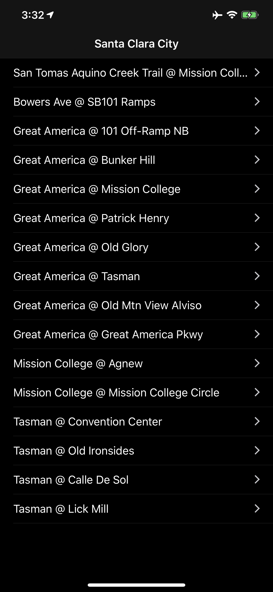

## SantaClaraCams

SantaClaraCams is an iOS app that provides an easy way to view the traffic cameras provided by [Santa Clara City](http://santaclaraca.gov/residents/maps/traffic-cameras) (California). Select a camera from the table view, or interactive map, to view the current stream. 

### Screenshots

